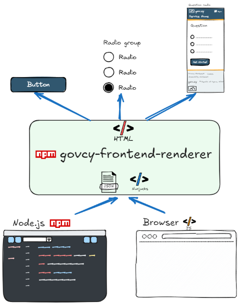

[](https://www.npmjs.com/package/@gov-cy/govcy-frontend-renderer)

[](https://github.com/gov-cy/govcy-frontend-renderer/actions/workflows/unit-test.yml)
[](https://github.com/gov-cy/govcy-frontend-renderer/actions/workflows/tag-and-publish-on-version-change.yml)

Use this package to render HTML for gov.cy elements, as they are defined in the [Unified Design System](https://gov-cy.github.io/govcy-design-system-docs/), using njk or json templates.



The project was developed to support the [gov.cy Unified Design System](https://gov-cy.github.io/govcy-design-system-docs/), so that the rendered HTML:
- is as close of a representation as possible of the design elements as they are defined in the [Unified Design System](https://gov-cy.github.io/govcy-design-system-docs/)
- includes the gov.cy branding
- uses the [govcy design system](https://gov-cy.github.io/govcy-design-system-docs/) css classes and javascript functions
- uses HTML best practices and be valid HTML
- uses accessibility best practices
- allows multiple languages
- is tested

Though the project is not intended to be used for production purposes and does provide any guaranties, your welcome to try it.

The project uses [nunjucks](https://mozilla.github.io/nunjucks/) templates to built the html.

The package currently works with the **version 3.2.0** of the design system.

## Features

The package can:
 can:

- Generate HTML programmatically from [input nunjucks template](#nunjucks-template-example), using the project's base template and macros.
- Generate HTML programmatically from [input JSON](#json-template-example) data
- Generate complete pages as well as [individual components](#render-individual-components-example)

## Pre-requisites
- You need to have [Node.js](https://nodejs.org/en/) installed. The package has been tested on node version 20. 

## Install

First, install the package using npm:

```shell
npm install @gov-cy/govcy-frontend-renderer
```

## Usage
First, you need to import the package as shown in the example below.

```js
import { govcyFrontendRenderer } from '@gov-cy/govcy-frontend-renderer';
```

The package's main functions accept an input:
- a **JSON object** with the [site and page meta data](#site-and-page-meta-data-explained) 
- and a **template** which can either be a [nunjucks template](#nunjucks-template-example) or a [JSON object](#json-template-example), that define the design elements to be rendered.

Whether you are using a nunjucks template or a JSON object, the result is identical as they are both rendered using the same nunjucks macros.

The output returned is a string with the rendered HTML.

### Nunjucks template example
Use a [string with a nunjucks template](#nunjucks-input-template) and the `renderFromString` function to render HTML from a nunjucks template. See the example below.

```js
import { govcyFrontendRenderer } from '@gov-cy/govcy-frontend-renderer';
const renderer = new govcyFrontendRenderer();

// Define the input data
const inputData = 
{    
    "site" : {
        "lang" : "en",
        "languages": [
            {"code": "el", "label": "EL", "alt": "Ελληνική γλώσσα", "href": "?lang=el"},
            {"code": "en", "label": "EN", "alt": "English language", "href": "?lang=en"}
        ],
        "footerLinks": [
            {"label": {"en":"Privacy statement", "el":"Δήλωση απορρήτου"}, "href": "#"},
            {"label": {"en":"Cookies", "el":"Cookies"}, "href": "#"},
            {"label": {"en":"Accessibility", "el":"Προσβασιμότητα"}, "href": "#"},
            {"label": {"en":"Help us improve this service", "el":"Βοηθήστε μας να βελτιώσουμε αυτή την υπηρεσία"}, "href": "#"}
        ],
        "menu" : {"en":"Menu", "el":"Μενου"},
        "title" : {"en":"Service title", "el":"Τιτλός υπηρεσίας"}, 
        "headerTitle" : {"en":"Header title", "el":"Τιτλός επικεφαλιδας"},
        "description" : {"en":"Service description", "el":"Περιγραφή υπηρεσίας"},
        "url" : "https://gov.cy",
        "manifest": "/manifest.json",
        "matomo": {
            "url": "//wp.matomo.dits.dmrid.gov.cy/",
            "siteId": "1234"
        },
        "cdn" : {
            "dist" : "https://cdn.jsdelivr.net/gh/gov-cy/govcy-design-system@3.0.0/dist",
            "cssIntegrity" : "sha384-1zLHWOtnS0hOIz5mVEPZp0UH5gUE6eo0CQcCGA3sF2TyYhHyKOd3Ni8Iy/NjEASU",
            "jsIntegrity" : "sha384-zOuDuogVaaTveh/Ou2iYwCk14zFiSmMk7Ax8yRnXDtOJMyKZH5+ZNibNVwZSKtw+"
        }
    },
    "pageData": {
        "title": {"en": "Page title", "el": "Τιτλός σελιδας"},
        "layout": "layouts/govcyBase.njk",
        "mainLayout": "max-width"
    }
};

// Define the template (njk)
let inputString = 
`
  



    {% call govcyElement("form",
        { 
            elements:
            [
                {
                    element: "textInput",
                    params: 
                    {
                        label:{en:"What is your name?",el:"Ποιο είναι το όνομα σας;"}
                        ,id:"name"
                        ,name:"name"
                        ,isPageHeading: true
                        ,autocomplete:"tel"
                    }
                },
                {
                    element:  "button",
                    params: {
                        text:{en:"Continue",el:"Συνέχεια"}
                        , type:"submit"
                    }
                }
            ]
        }) %}


`

// Render
let rtn = renderer.renderFromString(inputString, inputData)
console.log(rtn);

```
In the example above, a sting will be written in the console containing the rendered HTML of a complete page.

It is important to start your template string with the following:
- `  `: Will extend the gov.cy page template as defined in the `pageData.layout` property.
- ``: Will import the `govcyElement` macro which is responsible for rendering all the [design elements](#included-design-elements).
- ``: (Optional) Will import the `govcyUtilities` macro which includes [localization](#localization) and other utilities. 

To render design elements, the packages uses the `govcyElement` macro. See more details in the [design elements](DESIGN_ELEMENTS.md) section.

### JSON template example
Use a [JSON object as the template](#json-input-template) and the `renderFromJSON` function to render HTML from a nunjucks template. See the example below.

```js
import { govcyFrontendRenderer } from '@gov-cy/govcy-frontend-renderer';
const renderer = new govcyFrontendRenderer();

// Define the input data
const inputData = 
{    
    "site" : {
        "lang" : "en",
        "languages": [
            {"code": "el", "label": "EL", "alt": "Ελληνική γλώσσα", "href": "?lang=el"},
            {"code": "en", "label": "EN", "alt": "English language", "href": "?lang=en"}
        ],
        "footerLinks": [
            {"label": {"en":"Privacy statement", "el":"Δήλωση απορρήτου"}, "href": "#"},
            {"label": {"en":"Cookies", "el":"Cookies"}, "href": "#"},
            {"label": {"en":"Accessibility", "el":"Προσβασιμότητα"}, "href": "#"},
            {"label": {"en":"Help us improve this service", "el":"Βοηθήστε μας να βελτιώσουμε αυτή την υπηρεσία"}, "href": "#"}
        ],
        "menu" : {"en":"Menu", "el":"Μενου"},
        "title" : {"en":"Service title", "el":"Τιτλός υπηρεσίας"}, 
        "headerTitle" : {"en":"Header title", "el":"Τιτλός επικεφαλιδας"},
        "description" : {"en":"Service description", "el":"Περιγραφή υπηρεσίας"},
        "url" : "https://gov.cy",
        "manifest": "manifest.json",
        "matomo": {
            "url": "//wp.matomo.dits.dmrid.gov.cy/",
            "siteId": "1234"
        },
        "cdn" : {
            "dist" : "https://cdn.jsdelivr.net/gh/gov-cy/govcy-design-system@3.0.0/dist",
            "cssIntegrity" : "sha384-1zLHWOtnS0hOIz5mVEPZp0UH5gUE6eo0CQcCGA3sF2TyYhHyKOd3Ni8Iy/NjEASU",
            "jsIntegrity" : "sha384-zOuDuogVaaTveh/Ou2iYwCk14zFiSmMk7Ax8yRnXDtOJMyKZH5+ZNibNVwZSKtw+"
        }
    },
    "pageData": {
        "title": {"en": "Page title", "el": "Τιτλός σελιδας"},
        "layout": "layouts/govcyBase.njk",
        "mainLayout": "max-width"
    }
};

// Define the JSON template 
let inputJson =  
{
    "sections": [
        {
            "name": "main",
            "elements": [
                {
                    "element": "form",
                    "params": {
                        "elements": [
                            {
                                "element": "textInput",
                                "params": 
                                {
                                    "label":{"en":"What is your name?","el":"Ποιο είναι το όνομα σας;"}
                                    ,"id":"name"
                                    ,"name":"name"
                                    ,"isPageHeading": true
                                    ,"autocomplete":"tel"
                                }
                            },
                            {
                                "element": "button",
                                "params": 
                                {
                                    "text":{"en":"Continue","el":"Συνέχεια"}
                                    , "type":"submit"
                                }
                            }
                        ]
                    }
                }
            ]
        }
    ]
}
;

// Render
let rtn = renderer.renderFromJSON(inputJson, inputData)
console.log(rtn);
```
In the example above, a sting will be written in the console containing the rendered HTML of a complete page.

More details in defining design elements see in the [design elements](DESIGN_ELEMENTS.md) section.

### Render individual components example

To render individual components, use the same functions as above, but leave the `pageData.layout` empty, as shown in the example below (the example uses a JSON template). Everything except the `site.lang`in the *siteData* and *pageData* will be ignored.

```js
import { govcyFrontendRenderer } from '@gov-cy/govcy-frontend-renderer';
const renderer = new govcyFrontendRenderer();

// Define the input data
const inputData = 
{    
    "site" : {
        "lang" : "en"
    },
    "pageData": {
        "layout": "",
    }
};

// Define the JSON template 
let inputJson =  
{
    "sections": [
        {
            "name": "main",
            "elements": [
                {
                    "element": "form",
                    "params": {
                        "elements": [
                            {
                                "element": "textInput",
                                "params": 
                                {
                                    "label":{"en":"What is your name?","el":"Ποιο είναι το όνομα σας;"}
                                    ,"id":"name"
                                    ,"name":"name"
                                    ,"isPageHeading": true
                                    ,"autocomplete":"tel"
                                }
                            },
                            {
                                "element": "button",
                                "params": 
                                {
                                    "text":{"en":"Continue","el":"Συνέχεια"}
                                    , "type":"submit"
                                }
                            }
                        ]
                    }
                }
            ]
        }
    ]
}
;

// Render
let rtn = renderer.renderFromJSON(inputJson, inputData)
console.log(rtn);
```
All the `inputData` except the `site.lang` and the empty `pageData.layout` will be ignored.

### Site and page meta data explained
In the examples above an `inputData` object is defined and it is used to pass the site and page's meta data. They are used by the `layouts/govcyBase.njk` template to add the necessary HTML tags and attributes.

The `inputData` object has the following structure: 

- **site.lang**: the language of the site. It is used both in the `<html lang` attribute and to define the default language to be used by the individual design elements defined in the template. 
- **site.languages**: the languages in the language menu.
- **site.footerLinks**: the links of the footer.
- **site.menu**: the menu label.
- **site.title**: the title of the site. It is used in the `<title>`, `<meta property="og:title"` and `<meta property="twitter:title"` tags of the head.
- **site.description**: the description of the site. It is used in the `<meta name="description"`, `<meta property="og:description"` and `<meta property="twitter:description"` tags of the head.
- **site.url**: the URL of the site. It is used in the `<meta property="og:url"` and `<meta property="twitter:url"` tags of the head.
- **site.manifest**: the manifest of the site. It is used to add the manifest location to the page.
- **site.matomo**: the matomo data. It is used to add the Matomo code to the page. If you don't want to use Matomo tracking, you can remove this value. Use `site.matomo.url` to define the URL of the Matomo server and `site.matomo.siteId` to define the site ID to be tracked.
- **site.cdn.dist**: the CDN of the site. It is used to define the URL of the CDN used for the CSS and JS files. If you need to change the version of the CDN, you can do it by changing this value (in this case you will need to change the `site.cdn.cssIntegrity` and `site.cdn.jsIntegrity` values as well)
- **site.cdn.cssIntegrity**: the integrity of the CSS file. It is used to define the integrity of the CSS file. If you need to change the version of the CDN, you will need to change this value. https://www.srihash.org/ can help you generate the integrity value.
- **site.cdn.jsIntegrity**: the integrity of the JS file. It is used to define the integrity of the JS file. If you need to change the version of the CDN, you will need to change this value. https://www.srihash.org/ can help you generate the integrity value.
- **pageData.title**: the title of the page. It is used in the `<title>`, `<meta property="og:title"` and `<meta property="twitter:title"` tags of the head.
- **pageData.layout**: the layout of the page. It is used to define the layout (or page template) of the page, which is defined in the `layouts/govcyBase.njk` template.
- **pageData.mainLayout**: the main layout of the page. It can be either `two-thirds` or `max-width`.

### Input Template explained 
The input template can either be a JSON template or a nunjucks template string. It is used to define the design elements to be rendered.

#### Nunjucks input template
To use the pre-defined design elements, you need to import the `govcyElement` macro by including the`` as shown in the coded examples.

```js
// Define the template (njk)
let inputString = 
`
  



    {% call govcyElement("form",
        { 
            elements:
            [
                {
                    element: "textInput",
                    params: 
                    {
                        label:{en:"What is your name?",el:"Ποιο είναι το όνομα σας;"}
                        ,id:"name"
                        ,name:"name"
                        ,isPageHeading: true
                        ,autocomplete:"tel"
                    }
                },
                {
                    element:  "button",
                    params: {
                        text:{en:"Continue",el:"Συνέχεια"}
                        , type:"submit"
                    }
                }
            ]
        }) %}


`;
```

If your using the `pageData.layout`, you can render html in each of the following [gov.cy page template](https://gov-cy.github.io/govcy-design-system-docs/getting-started/page-template/) blocks:
- **bodyStart**: the start of the body
- **userName**: the section where the username and logout links are rendered
- **header**: the header section (where the gov.cy logo and service name are rendered)
- **beforeMain**: the section before the main content
- **main**: the main content
- **footer**: the footer section
- **bodyEnd**: the end of the body

Use the `govcyElement` macro inside the blocks to render the design elements defined in the `govcyElement.njk` template. More details in defining design elements see in the [design elements](DESIGN_ELEMENTS.md) section.

#### JSON input template
When using a JSON input template, there is no need to import or extend anything.

```js
// Define the JSON template 
let inputJson =  
{
    "sections": [
        {
            "name": "main",
            "elements": [
                {
                    "element": "form",
                    "params": {
                        "elements": [
                            {
                                "element": "textInput",
                                "params": 
                                {
                                    "label":{"en":"What is your name?","el":"Ποιο είναι το όνομα σας;"}
                                    ,"id":"name"
                                    ,"name":"name"
                                    ,"isPageHeading": true
                                    ,"autocomplete":"tel"
                                }
                            },
                            {
                                "element": "button",
                                "params": 
                                {
                                    "text":{"en":"Continue","el":"Συνέχεια"}
                                    , "type":"submit"
                                }
                            }
                        ]
                    }
                }
            ]
        }
    ]
}
;

```

If your using the `pageData.layout`, you can render html in each of the following [gov.cy page template](https://gov-cy.github.io/govcy-design-system-docs/getting-started/page-template/) blocks, by using the `sections` array (in a similar way `blocks` is use ) :
- **bodyStart**: the start of the body
- **userName**: the section where the username and logout links are rendered
- **header**: the header section (where the gov.cy logo and service name are rendered)
- **beforeMain**: the section before the main content
- **main**: the main content
- **footer**: the footer section
- **bodyEnd**: the end of the body

Define your design elements for each `sections` under the `elements` array. These elements use the same `govcyElement` macro to render the design elements. Do that by defining the `element` and `params` objects. For example:

```json
{
    "element": "textInput",
    "params": 
    {
        "label":{"en":"What is your name?","el":"Ποιο είναι το όνομα σας;"}
    }
}
```

will use the `govcyElement` macro to render the `textInput` design element as follows:

```Nunjucks
{{ 
    govcyElement({
    "textInput", 
    {
        "label":{"en":"What is your name?","el":"Ποιο είναι το όνομα σας;"}
    }
    }) 
}}
```

More details in defining design elements see in the [design elements](DESIGN_ELEMENTS.md) section.

#### Included design elements 
More details on the elements that are supported by the package and how to include them in your templates, can be found on the [design elements](DESIGN_ELEMENTS.md) document.

### Localization
All content in design elements are defined with an object defining the available languages and their content. For example `label":{"en":"What is your name?","el":"Ποιο είναι το όνομα σας;"}`. When rendering the package will determin which language to use with the following logic and order:

1. if `params.lang` is defined in the design element, use that
2. else if `site.lang` is defined in the `siteData`, use that
3. else use `el`

If the `params.lang` is defined in the design element, the package will also render element with a `lang` attribute. 

## Browser usage (client-side)  
> [!WARNING]  
> Browser classes are not thoroughly tested, so use with care.  

The package offers compiled templates in `govcyCompiledTemplates.browser.js` and a helper class `govcyFrontendRenderer.browser.js` to render the same components on the browser. Unlike the note.js methods, you will need to provide the HTML shell. 

The easiest way to use these is to include the libraries via CDN in your HTML and use the `renderFromJSON` and `updateDOMAndInitialize` functions.

Here's an example:

```html

<!DOCTYPE html>
<html lang="en">

<head>
  <!-- Required meta tags -->
  <meta charset="utf-8">
  <meta name="viewport" content="width=device-width, initial-scale=1">
  <!-- CSS -->
  <link rel="stylesheet" href="https://cdn.jsdelivr.net/gh/gov-cy/govcy-design-system@v3/dist/css/govcy.uds.min.css">
  <title>Page title - Service Name - gov.cy</title>
  <meta name="description" content="Description of what the service does">

</head>

<body>
  <!--bodyStart-->
  <section class="govcy-container-fluid" id="bodyStartContainer">
    <a href="#mainContainer" class="govcy-skip-link">Skip to main content</a>
  </section>
  <!--main-->
  <main class="govcy-container" id="mainContainer">
    <div class="govcy-row">
      <article class="govcy-col-8">
        <div id="output" class="govcy-form"></div>
      </article>
    </div>
  </main>
<script src="https://cdn.jsdelivr.net/gh/gov-cy/govcy-design-system@v3/dist/js/govcy.uds.min.js"></script>
<script src="https://cdn.jsdelivr.net/gh/gov-cy/govcy-frontend-renderer@v1/dist/govcyCompiledTemplates.browser.js"></script>
<script src="https://cdn.jsdelivr.net/gh/gov-cy/govcy-frontend-renderer@v1/dist/govcyFrontendRenderer.browser.js"></script>
<script>

    document.addEventListener("DOMContentLoaded", async function () {
      
        // Create an instance of GovcyFrontendRendererBrowser
        const renderer = new GovcyFrontendRendererBrowser();

        // Define the input data
        const inputData =
        {
          "site": {
            "lang": "en"
          }
        };

        // Construct the JSONTemplate
        const JSONTemplate = {
          "elements": [
                {
                    "element": "backLink",
                    "params": {}
                },
                {
                    "element": "tag",
                    "params": {
                        "text": {
                            "en": "SIMPLE TAG",
                            "el": "ΑΠΛΟ TAG"
                        }
                    }
                }
            ]
        };
        
        //render HTML into string
        let renderedHtml = renderer.renderFromJSON(JSONTemplate,inputData);
        //update DOM and initialize the JS components
        renderer.updateDOMAndInitialize('output', renderedHtml);
    });
  </script>
</body>

</html>
```

### Things you should know about browser usage
Using the example above as reference: 
1. `renderer.renderFromJSON(JSONTemplate,inputData);` generates the HTML based on the JSON input template.
2. `renderer.updateDOMAndInitialize('output', renderedHtml);` updates the DOM and initializes the JS components. It finds the element with id `output` and :
    - used the `innerHTML` to update it's contents
    - initializes all GOVCY design system's JS components within that elements (so it will not re-initialize other elements such as `header` in different sections of the page)

## Change the package

Details on how to build, test and update the project can be found in the [project notes](NOTES.md) document.

## License

The package is released under the [MIT License](https://opensource.org/licenses/MIT).

## Contact

If you have any questions or feedback, please feel free to reach out to us at [dsf-admin@dits.dmrid.gov.cy](mailto:dsf-admin@dits.dmrid.gov.cy)